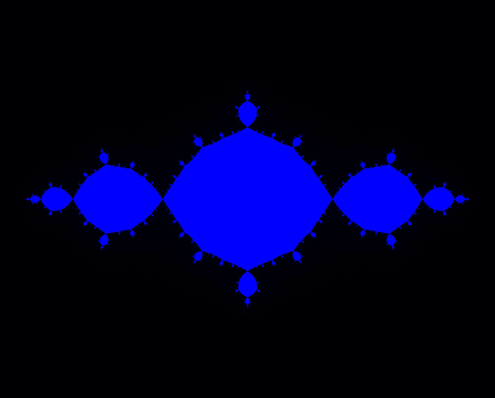

## Julia Sets
-----

### Plotting Julia sets on Argand diagrams

This leads on from my Extended Essay, a [brief presentation can be found here](http://prezi.com/cyg1ladocm9d/my-extended-essay-exploring-julia-sets/).

Originally written in terrible Javascript, then as I learnt Python and C, I re-wrote the program in each of them.

### Output
Put simply, by counting the number of iterations each "cell" must go through before it explodes past a certain threshold, you can plot a rough output on Bash:

By colour-coding and outputting to jpg, higher resolution images are available:

And by looping through different parameters to the function, a funky gif can also be generated:

